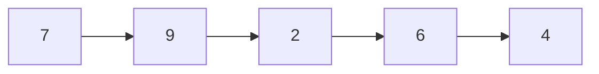

## **動態記憶體配置**

假設要放入資料結構的資料數是無法事先預期得，有一筆資料要加入時，再向系統要求記憶體空間，這個機制就是 `malloc` 函式，要來的記憶體可以使用 `free`函式還回去給系統。

malloc 的參數 size 代表我們要求的記憶體大小，回傳值代表記憶體位址，如果系統無法提供足夠記憶體，malloc會回傳特殊指標值NULL。

malloc 的回傳值類別為 `void *`，`代表是一個無固定類別的指標`，如果我們知道這塊記憶體是要作為 int 使用我們就必須使用變數類別轉換，將 `void *` 轉形成 `int*`。

```C
#include ‹stdlib.h>
void #malloc (int size)
void free (void *ptr);
struct node *ptr;

ptr = (struct node *)malloc (sizeof (struct node));
...
free (ptr);
```

我們可以宣告一個指標指 ptr 向 malloc 所回傳回來的記憶體位址，因為這塊記憶體不是一個變數，所以他沒有名字，完全靠 ptr 操作，如果我們將 ptr 指向其他地方就再也沒辦法使用這塊記憶體。當我們要還回這塊記憶體空間，我們必須用 `free` 函式，free 的參數就是當初要來的記憶體位址。

---
## **assert**

`assert`是一個函式，定義在 `<assert.h>`標頭檔裡面，後面接一個condition，如果 condition 不為真，程式馬上就停止，可以用來確保程式執行狀況如我們所預期。

```C
#include <assert.h>
...
assert(condition)
```

---
## **Linked List**
一個鏈結序列是一個節點集合，每一個節點都可以儲存資料。節點之間的連結方法是第一個節點指向第二個節點，第二個節點指向第三個節點，依此類推。




```C
// Linked List Node:
typedef struct listnode{
    int data;
    struct listnode *next;
} ListNode;
```

## **Binary Tree**
一個二元樹就是一個二元樹節點的集合。一個二元樹節點有兩個指標，分別指向兩個節點。
- NUII 是二元樹。
- 一個節點加上該節點指向的左二元樹及右二元樹，也是一個二元樹。

該節點為二元樹的根節點 `(root)`，根節點指向的左二元樹稱為左子樹 `(left subtree)`，根節點指向的右二元樹稱為右子樹 `(right subtree)`。左右子樹的根節點是此二元樹根節點的子節點`（child）`。而此二
元樹根節點是左右子樹之根節點的父節點 `(parent)`。

二元樹遞迴定義和鏈結序列遞迥定義很相似。只不過每一個鏈結序列節點可以接一個鏈結序列節點，而每一個二元樹節點可以接兩個二元樹節點。因為二元樹可以接兩個節點，所以不適合以迴圈的方式處理，我們多半會用遞迴的方式處理。

```C
// Binary Tree Node:
typedef struct treenode{
    int data;
    struct treenode *left;
    struct treenode *right;
} TreeNode;
```

### **Binary Search Tree**

根據節點儲存的資料大小關係決定在二元樹中節點的位置。
定義如下：
- NULL 是-一個二元搜尋樹。
- 一個節點如果滿足以下三個條件，那麼這個節點加上左右子樹也是一個二元搜尋樹。
  1. 左右子樹都是二元搜尋樹。
  2. 所有左子樹節點的資料都不大於該節點的資料。
  3. 所有右子樹節點的資料都不小於該節點的資料。

### **Binary Tree Traversal**

走遍樹中所有節點的動作稱為樹遍歷 (tree traversal)。常用的樹遍歷分為下列三種：
- `前序 (preorder)`
  1. 處理根節點的資料。
  2. 以遞迴的方式處理左子樹。
  3. 以遞迴的方式處理右子樹。
- `中序 (inorder)`
  1. 以遞迴的方式虎理左子樹。
  2. 處理根節點的資料。
  3. 以遞迴的方式虎理右子樹。
- `後序 (postorder)`
  1. 以遞迴的方式處理左子樹。
  2. 以遞迥的方式處理右子樹。
  3. 處理根節點的資料。

### **二元樹重建**

如果給定前序與中序我們就能決定二元樹的形狀。給定前序，我們就可以知道二元樹根節點為何，知道二元樹的根節點，就可以從中序得知左子樹與右子樹包含哪些節點。

例如我們如果知道`前序為 ABCDE，中序為 CBDAE`，則由前序可得知二元樹的根節點為 A，由中序可得知`左子樹包括 CBD，右子樹包括E。`套用遞迴的想法，原來的問題現在變成兩個類似的子問題。
- 左子樹: 前序為 BCD，中序為 CBD，重建二元樹。
- 右子樹: 前序為E，中序為E，重建二元樹。

套用遞迴的概念，我們建立一個根節點 A，**再將第一個子問題的解答二元樹當成 A 的左子樹**，**再將第二個子問題的解答二元樹當成 A 的右子樹**，這個二元樹就是原先問題的解答